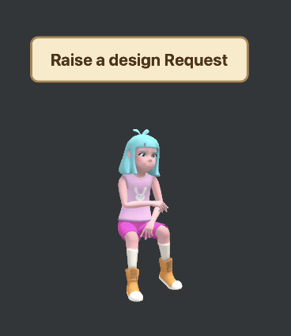

# ToDoBuddy

A native macOS task management app with an animated 3D character companion that lives on your desktop, keeping your current task always in sight.

<p align="center">
  
</p>

## About

ToDoBuddy is not your ordinary to-do list. It features a persistent floating 3D character that sits on your desktop and displays your current task on a sign board above its head. The character follows you across multiple monitors and macOS Spaces, acting as a friendly productivity companion. Click the character to open the full task manager, or manage tasks from the menu bar — ToDoBuddy stays out of your way while keeping you focused.

## Features

- **3D Character Companion** — An animated 3D character floats on your desktop, displaying your current task on a dynamic sign board
- **5 Character Options** — Choose from Catwalk (walking), Clapping, Laughing, Rubbing Arm, and Rubbing Arm Alt (MEDEA variant), all sourced from Mixamo
- **Multi-Monitor Support** — The floating character automatically follows your cursor across displays with smooth animation
- **Menu Bar Integration** — Quick access to your current task and the app from the macOS status bar
- **Task Organization** — Tasks are split into Today, Missed (overdue), History, and Scheduled (future) views
- **Drag & Drop Reordering** — Reorder tasks with drag handles
- **30-Minute Reminders** — Automatic macOS notifications every 30 minutes to keep you on track
- **Missed Task Alerts** — Incomplete tasks from past dates are highlighted and can be rescheduled to today
- **History with Undo** — View completed tasks by date, copy to clipboard, and optionally undo completions
- **Persistent Storage** — Tasks are saved locally as JSON; preferences stored in UserDefaults

## Tech Stack

| Layer | Technology |
|-------|-----------|
| Language | Swift 5.0 |
| UI Framework | SwiftUI |
| 3D Engine | SceneKit |
| Architecture | MVVM with `@Observable` |
| Data Persistence | JSON (Codable) + UserDefaults |
| Notifications | UserNotifications |
| macOS APIs | NSStatusBar, NSPanel, NSApplication |
| 3D Models | DAE (Collada) from Mixamo |
| Texturing | PBR with diffuse, specular, normal, and glossiness maps |
| Build System | Xcode 26.1+ |

## How the 3D Character Works

The character system is built on **SceneKit** with a full rendering pipeline:

1. **Model Loading** — DAE files with embedded skeletal animations are loaded from the app bundle, with OBJ fallback and a placeholder box as last resort
2. **Auto-Scaling** — Models are normalized to 1.6 units height regardless of original dimensions
3. **Animation** — Embedded Mixamo animations loop infinitely; static models get a procedural walk cycle with stepping, turning, and idle bobbing
4. **PBR Texturing** — Materials use diffuse, specular, normal, and glossiness texture maps for realistic rendering
5. **3-Point Lighting** — Studio-quality setup with ambient (600), key (1000), fill (400), and rim (300) intensity lights
6. **Floating Sign Board** — A 3D plane with billboard constraint renders the current task title using custom `NSImage` drawing with cream background, brown border, and shadow

## Project Structure

```
ToDoBuddy/
├── AppDelegate.swift                 # App lifecycle, status bar, notifications
├── ToDoBuddyApp.swift                # SwiftUI app entry point
├── Managers/
│   └── FloatingPanelController.swift # Floating panel & multi-monitor tracking
├── Models/
│   ├── TaskItem.swift                # Task data model (Codable)
│   ├── TaskStore.swift               # Singleton state manager & persistence
│   └── CharacterOption.swift         # Character selection definitions
├── Views/
│   ├── CharacterView.swift           # SceneKit 3D character rendering
│   ├── MainWindowView.swift          # Tab-based main window
│   ├── TodayView.swift               # Today & missed tasks
│   ├── HistoryView.swift             # Completed task history
│   ├── UpcomingView.swift            # Future scheduled tasks
│   └── SettingsView.swift            # Character selection & options
└── Resources/
    ├── *.dae                         # 3D character models (Mixamo)
    └── *.png                         # Texture maps (diffuse, specular, normal)
```

## Data Storage

- **Tasks:** `~/Library/Application Support/TaskBuddy/tasks.json`
- **Preferences:** `~/Library/Preferences/com.learning.ToDoBuddy.plist` (via UserDefaults)

## Requirements

- macOS 26.0+
- Xcode 26.1+

## Getting Started

1. Clone the repository
   ```bash
   git clone https://github.com/deva-551/ToDoBuddy.git
   ```
2. Open `ToDoBuddy.xcodeproj` in Xcode
3. Build and run (Cmd + R)
4. The 3D character will appear on your desktop — click it to open the task manager

## License

This project is for personal/educational use.
